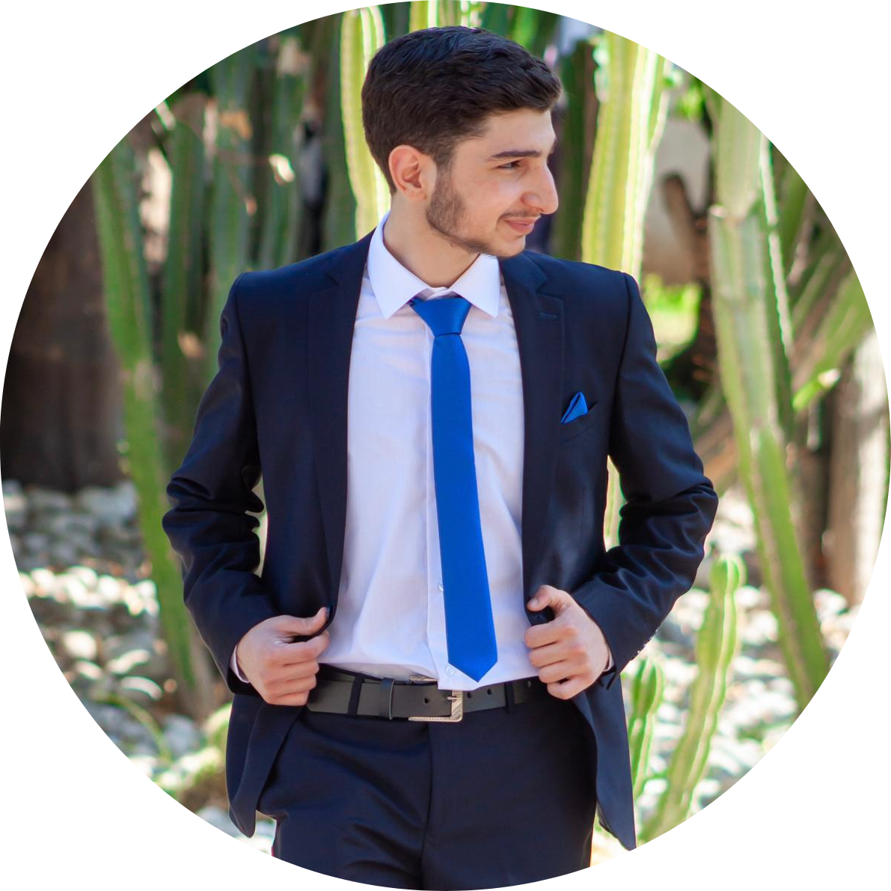

# Abdel Rahman Assoum

Hello, I am 18 years old, I have been working in the field of graphic design for 3 years, and now I have gone to my main goal, which is programming. So now, I am in Codi to achieve this goal.

> Education
> --

- Lebanese Baccalaureate (07/2022)

 >Certificate
 >--
 - Google IT Support Certificate (10/2022)
 - Google UX Design Certificate (11/2022
 - Microsoft Office Specialist in Excel (03/2017)
 >Experience
 >--
- **3 years of Graphic Design:** 
I started in the field of graphic design when I volunteered in the media team of an association, where we learned the basics and launched our career in this field. I have tried many types, such as social media posts, posters, logos, and in the current period, user interfaces
- **7 years volunteer in Iman Scout:** 
I've been in Scouting since 2016 and I was a member at the time. I learned many skills on the scouting, technical and scientific levels, in addition to soft skills. And 3 years ago I became a leader in it, training the elements and giving them my experience  
---
[Github](https://github.com/abdelrahman-assoum)